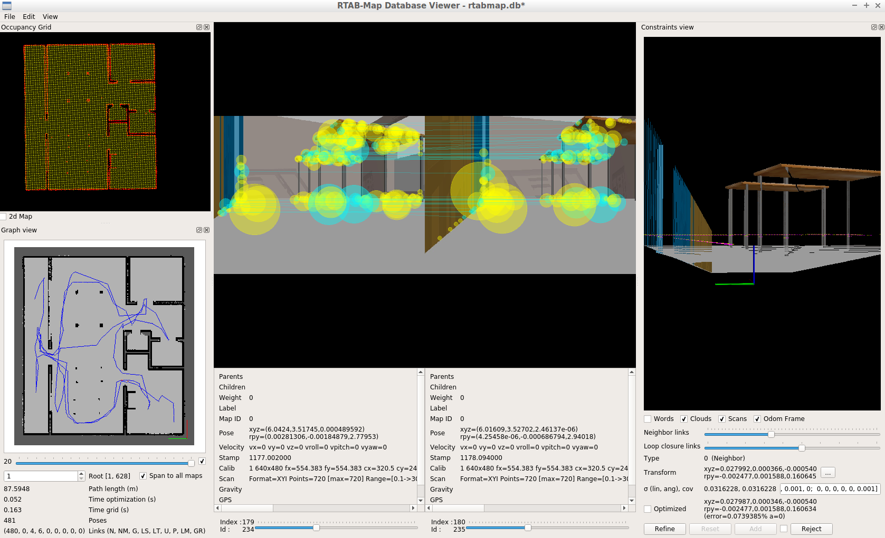

# Udacity - Robotics Software Engineer Nanodegree

- Project 1: Build Gazebo World
- Project 2: Ball Chasing Robot
- Project 3: Localization
- Project 4: Mapping and SLAM
- Project 5: Home Service Robot

## Demo
### [Project 1](Project1)

### [Project 2](Project2)
Robot detects the white ball in the scene and drive towards it.

### [Project 3](Project3)
Adaptive Monte Carlo Localization

### [Project 4](Project4)
Building map ground truth

`RTAB-Map` map database

### [Project 5](Project5)
Robot navitage to pick an object (blue square) and drop it off at another location.

